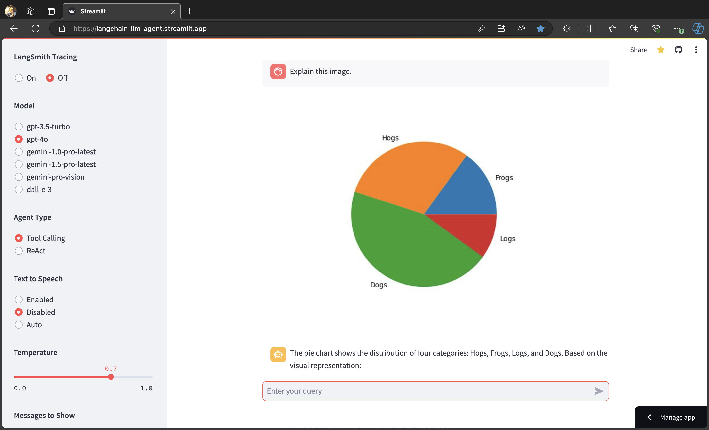

# [LangChain_LLM_Agent](https://langchain-llm-agent.streamlit.app/)

* This app generates text and images using OpenAI's APIs and LangChain.
  
  - Your OpenAI API key is required to run this code. You can obtain an API key
    from https://platform.openai.com/account/api-keys.

  - Text outputs are generated using large language models such as "gpt-3.5-turbo",
    "gpt-4-turbo", or "gpt-4-vision-preview", and images are generated using
    "dall-e-3."

  - Temperature can be set by the user

  - Voice recognition and Text-To-Speech (TTS) functionalities are supported.

  - Recording of the user's voice is stopped when there is no input for 3 seconds.
  
  - Supported tools include Bing Search, ArXiv, Retrieval (RAG), and python_REPL.
    * To use Bing Search, you need a Bing Subscription Key that can be obtained
      [here](https://app.tavily.com/](https://portal.azure.com/). You can also
      follow instructions on
      [this site](https://levelup.gitconnected.com/api-tutorial-how-to-use-bing-web-search-api-in-python-4165d5592a7e)
      to get your Bing Subscription Key.
    * PythonREPL from LangChain is still experimental, and therefore caution is
      needed. Users are also advised to choose gpt-4-turbo-preview with Python REPL.

  - Tracing LLM messages is possible using LangSmith if you download the source code
    and run it on your machine or server.  For this, you need a
    LangChain API key that can be obtained [here](https://smith.langchain.com/settings).

  - When running the code on your machine or server, you can use st.secrets to keep and
    fetch your API keys as environments variables. For such secrets management, see
    [this page](https://docs.streamlit.io/deploy/streamlit-community-cloud/deploy-your-app/secrets-management).

## Usage
```python
streamlit run LangChain_llm_Agent.py
```
[](https://youtu.be/ux7ux8YXnMI)
