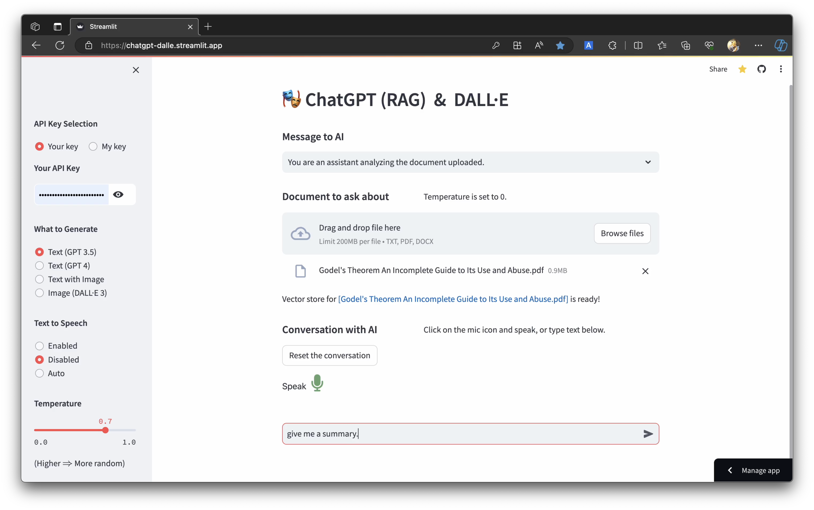

# [ChatGPT & DALL·E](https://chatgpt-dalle.streamlit.app/)

* This app generates text and images using OpenAI's APIs
  
  - Text outputs are generated by using the models "gpt-3.5-turbo",
    "gpt-4-turbo", or "gpt-4-vision-preview" from OpenAI

  - Temperature can be set by the user

  - Voice recognition and Text-To-Speech (TTS) are implemented by using
    functions from OpenAI

  - Recording of the user's voice is stopped when there is no input for 3 seconds
  
  - RAG (Retrieval Augmented Generation) for an external document is implemented
    by using langchain functions.

* This page is written in python using the Streamlit framework.

* Your OpenAI API key is required to run this code. You can obtain an API key
  from https://platform.openai.com/account/api-keys. If, for some reason, you
  do not want to obtain an API key but would still like to try this code,
  you will need to request a password.

## Usage
[](files/Streamlit_LLM_App.mp4 "Exploring the App: A Visual Guide")
```python
streamlit run OpenAI_Generator.py
```
